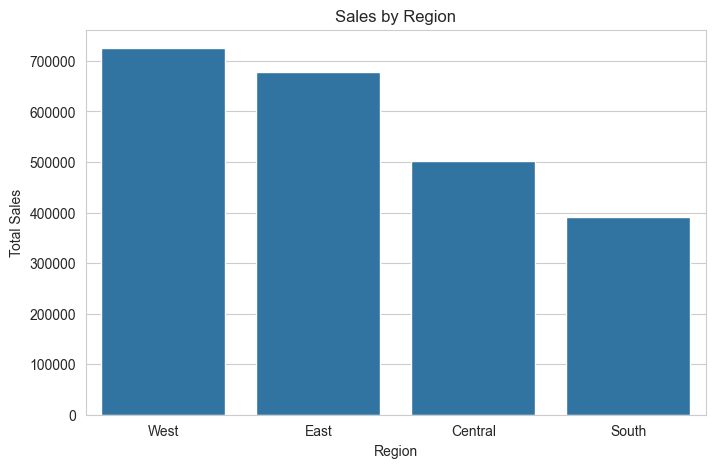
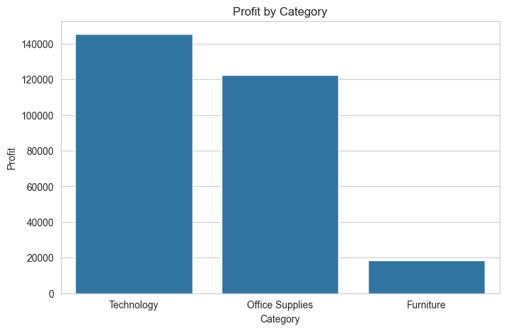
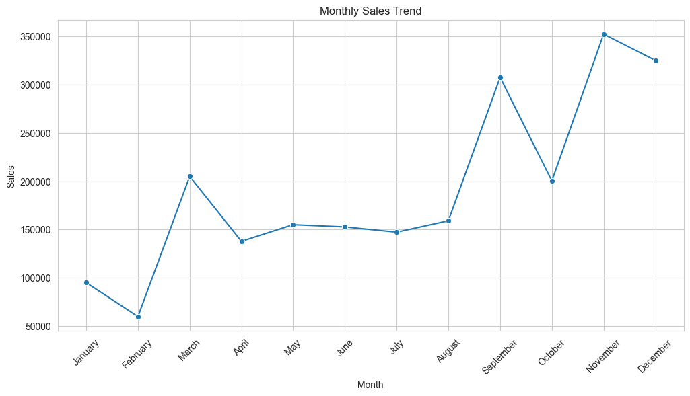
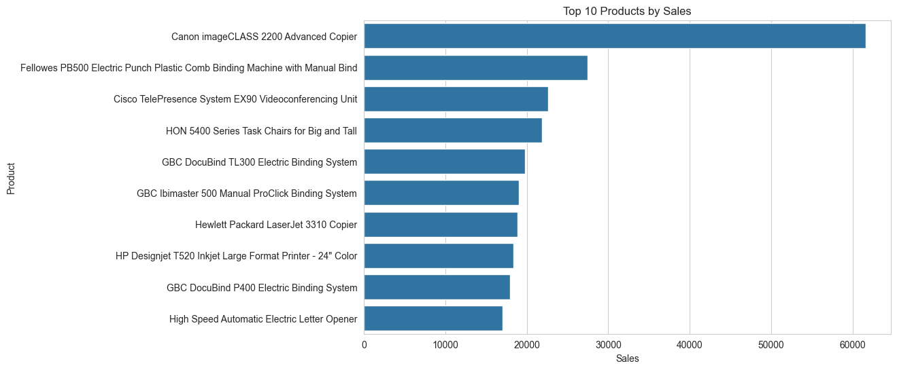
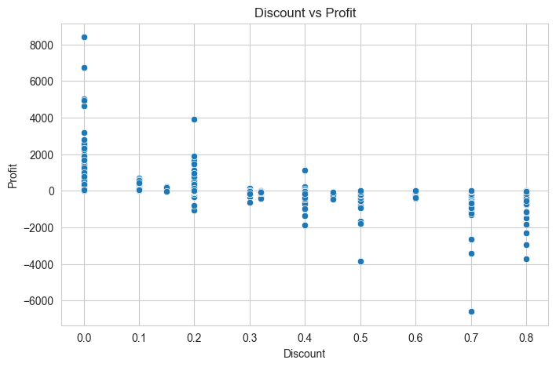

# Retail Sales Performance Analysis and Business Insights

## Project Overview
This project analyzes retail sales data from a Superstore dataset to evaluate business performance, identify profitable categories, understand regional sales distribution, and assess the impact of discount strategies on profitability.

The analysis includes:
- Data cleaning and preprocessing
- Exploratory Data Analysis (EDA)
- KPI evaluation
- Business insights and recommendations

---

## Dataset Summary

| Metric | Value |
|--------|-------|
| Total Records | 9,994 |
| Total Columns | 21 |
| Missing Values | 0 |
| Duplicate Records | 0 |

---

## Key Performance Indicators (KPIs)

| KPI | Value |
|-----|-------|
| Total Sales | $2,297,200.86 |
| Total Profit | $286,397.02 |
| Average Order Value | $458.61 |

---

# Business Performance Diagrams

## 1. Sales by Region

### Observation
- West region generated the highest sales.
- South region showed the lowest sales performance.

---

## 2. Profit by Category

### Observation
- Technology category delivered the highest profit.
- Furniture category showed significantly low profitability.

---

## 3. Monthly Sales Trend

### Observation
- Sales increased significantly in Q4.
- November recorded peak sales performance.
- February showed the lowest sales.

---

## 4. Top 10 Products by Sales

### Observation
- High-value technology and office equipment dominate top-performing products.
- Product concentration suggests dependency on specific items.

---

## 5. Discount vs Profit Analysis

### Observation
- Higher discounts strongly correlate with lower profits.
- Excessive discounting frequently leads to financial losses.

---

# Key Insights

## Insight 1: Technology is the strongest business segment
Technology generated the highest revenue (**$836,154**) and highest profit (**$145,454**), making it the most successful category.

---

## Insight 2: Furniture is underperforming
Although Furniture contributed strong sales (**$741,999**), profit remained extremely low (**$18,451**), indicating inefficient pricing or discount policies.

---

## Insight 3: West region dominates sales performance
The West region achieved the highest revenue (**$725,457**) and strongest profitability.

---

## Insight 4: High discounts damage profitability
The discount analysis clearly shows that aggressive discounting reduces profit margins and often creates losses.

---

## Insight 5: Q4 is the strongest sales season
November and December generated the highest sales, suggesting strong seasonal purchasing behavior.

---

# Business Recommendations

## Recommendation 1
Reduce excessive discounting, especially on already low-margin products.

## Recommendation 2
Reevaluate Furniture pricing strategy and operational costs.

## Recommendation 3
Increase marketing campaigns and inventory allocation during Q4 peak periods.

## Recommendation 4
Investigate weaker-performing regions (Central and South) for operational improvements.

---

# Conclusion

This retail sales analysis reveals clear opportunities for improving profitability through better pricing strategies, optimized discount policies, and targeted regional growth initiatives.

Technology remains the strongest category, while Furniture requires immediate business attention.

The analysis demonstrates how data-driven decision-making can improve operational efficiency and profitability.

---

## Tools Used
- Python
- Pandas
- Matplotlib
- Seaborn
- Jupyter Notebook / VS Code
